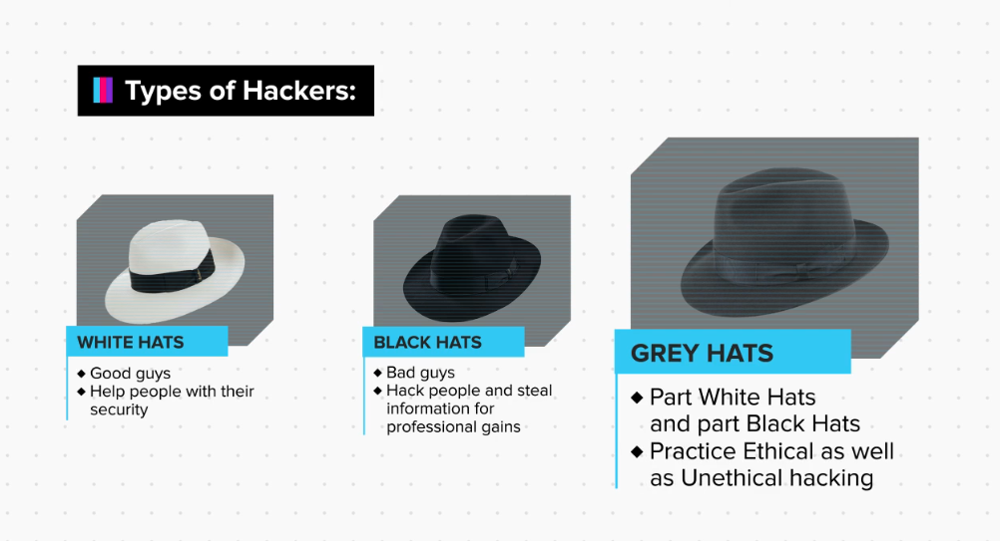
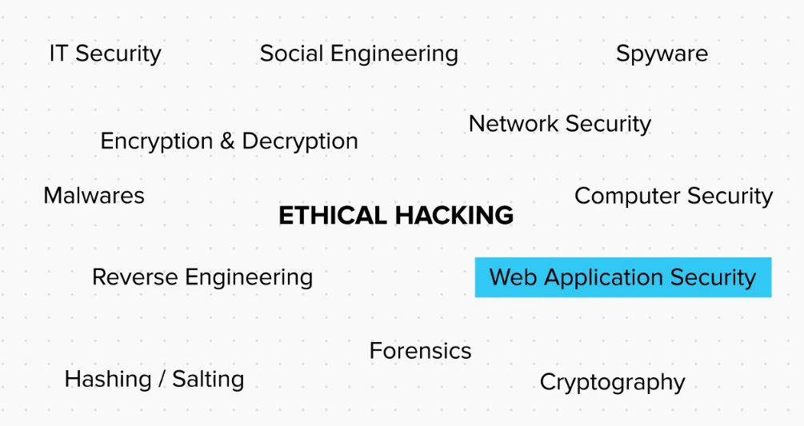

Q. What is Hacking?  
Hacking is the art or technique of finding and exploiting a security loophole in an infrastructure like a website, a software, a computer, or even a human being, and the artist is called a hacker.  
  
Q. What does loopholes in a system mean?  
In technical terms, a loophole can be referred to a part of a system which is not properly defined or secured and hence can be exploited to cause unintended things in the system.

Q. What is Unethical Hacking?  
When a hacker uses his knowledge to steal from or cause damage to other people, it is known as Unethical Hacking. Like stealing, unethical hacking is also a crime and if caught, the thief will be arrested and would be tried in court.  
  
Q. What is Ethical Hacking?  
When the hacker helps organisations or individuals with finding security loopholes and fixing them with their permission, it is referred to as ethical hacking. And this is legal because you take permission from the system owner and your motive is not to cause harm or steal, but to secure the system.  
  
Q. What is considered a cyber crime according to Indian Judiciary system?  
The Indian Cyber Laws and the Indian IT act classifies cybercrimes into 2 broad categories. An activity is considered a cyber crime if.
1. A computer is being used to attack other computers. For example: hacking, virus/worm attacks, DOS attacks, etc.  
2. A computer is being used as a weapon to commit real world crimes. For example: cyber terrorism, IPR violations, credit card frauds, EFT frauds, pornography, etc.  
  
This basically means that unlawful use of any computer/device is considered a Cyber Crime.

**Types of Hacker :**

Here we will talk about white hat hacker methodology to find loopholes in a system.
Also some methodology of black hat hacker used and how a white hat hacker can tackle them.

`Ethical Hacking ` can be used in :

We will discuss about Ethical Hacking in `Web Applicationi Security`.

***MCQ***

 1. Vyom has recently learnt how to use some tools on websites to find vulnerabilities. In an attempt to impress his computer teacher and get appreciation he starts testing on the college website. But, alas, his teacher one day catches him after school hours in the computer lab, testing the college website. What can the college do?
 
	 - [ ] Since he had no malicious intent, there is no background to build up a legal case against Vyom.
	 - [x] His college authorities can in fact file a case against him under the Indian Cyber Law for testing on their website without proper consent.
 
	>**Explanation:**
	> Even if you mean no harm, an organization, in this case the college authorities, under the Indian Cyber Law, can file a case against you if you choose to test their website without consent. Though, if you don't misuse a loophole and neither cause any damage while looking for it, most organizations will appreciate your effort. But, one must not take their chances when legal matters are concerned. Better to be safe, than sorry.

2. Riya has been receiving spam/fake email since a long time now. Can she call the spammer a criminal and report against him?
	
	 - [x] Yes
	> **Explanation**
	Sending spam in bulk, flooding someone's email with junk emails, or impersonating an email authority, are all criminal offences under the Indian cyber law.

	 - [ ] No

3. Joey is a grey hat hacker. Well, for the most part of it he helps organizations fix their security loopholes, but sometimes, he is naughty and uses his knowledge to order cool T shirts for himself on 80% off using a small loophole in the website. It’s a weakness you see. Now, Joey feels he is safe from authorities, since he is a security expert who helps organizations. Do you think that is correct?

	 - [ ] Yes
	 - [x] No
	> **Explanation**
	Even if a grey hat hacker does minor black hat activities such as using/distributing cracks/pirated software, creating fake social media accounts for fun or editing his/her attendance in college, if caught, can be charged for cyber offence.

4. Which of the following actions are considered a cyber crime if done without prior consent?

	 - [ ] Hijacking a device or data by exploiting a vulnerability.

	- [ ] Trying to exploit a vulnerability.

	- [ ] Looking for a weakness/vulnerability.

	- [x] All of the above.

	> **Explanation**
	> Cyber laws not only consider gaining access to/corrupting devices/data owned by others as a crime, but also the act of attempting to gain access, whether you actually gain it or not, is considered a crime.
    

`Note`
1. Kevin Mitnick is an American Security expert and called the “World’s most famous hacker”. He was arrested twice for cyber crime and wire fraud; an event quoted as the “manhunt”. Read more and find out such interesting facts about Kevin Mitnick.  
  
2. You may watch the following movies and TV series and learn a trick or two..  
Hackers- 1995  
Mr. Robot (TV series)  
  
3. Read about some other types of hackers, such as:  
Script Kiddies  
Elite Hackers  
State Sponsored Hackers  
Hacktivists  
Phreaks  
  
4. Read more about Indian cyber laws and the Indian IT act.
